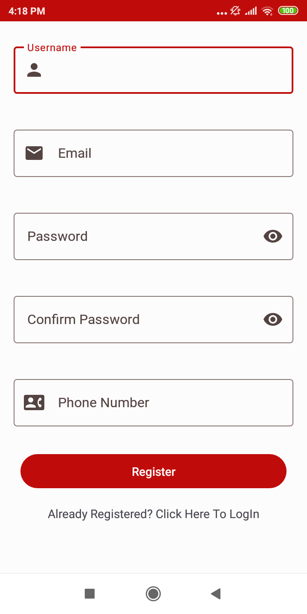
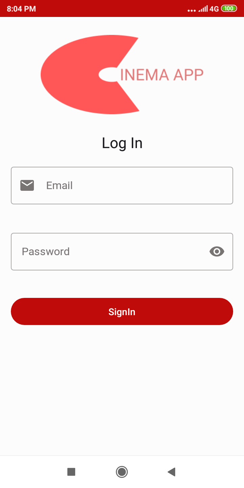
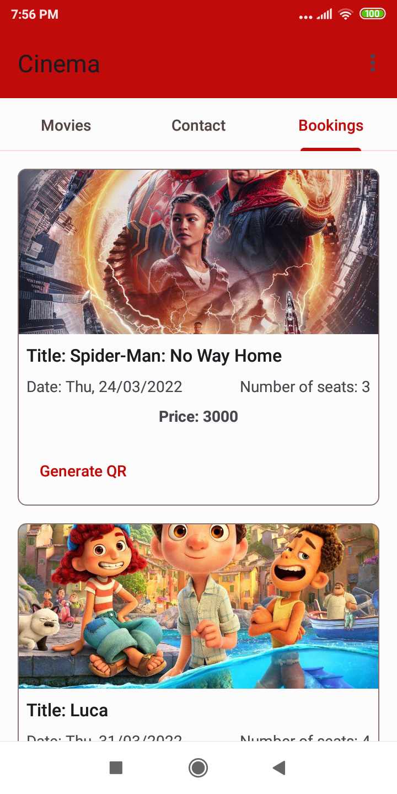
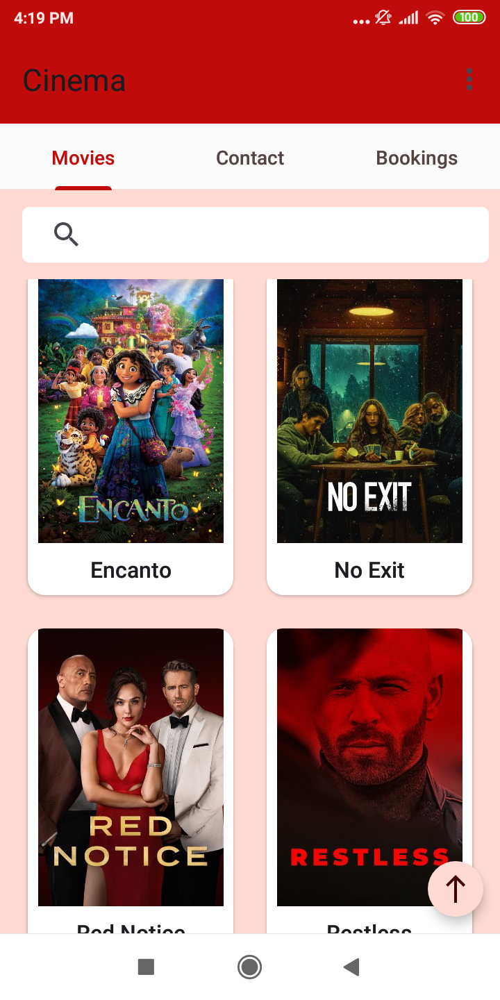
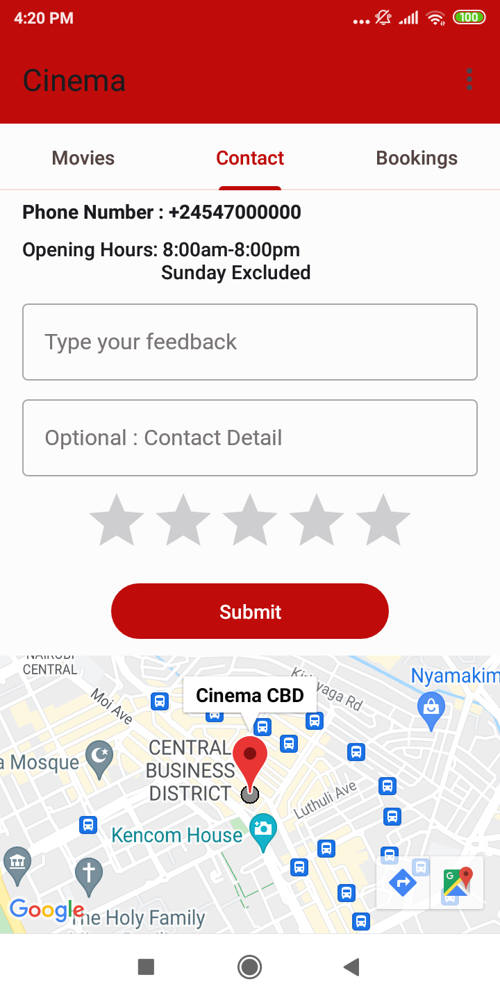
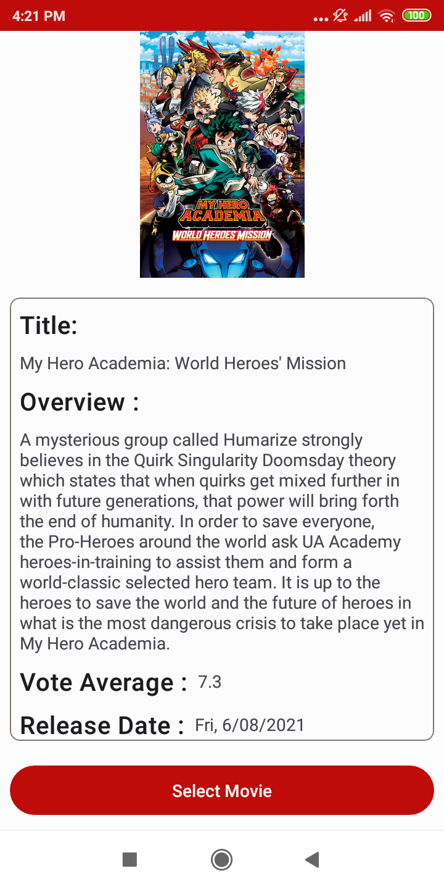
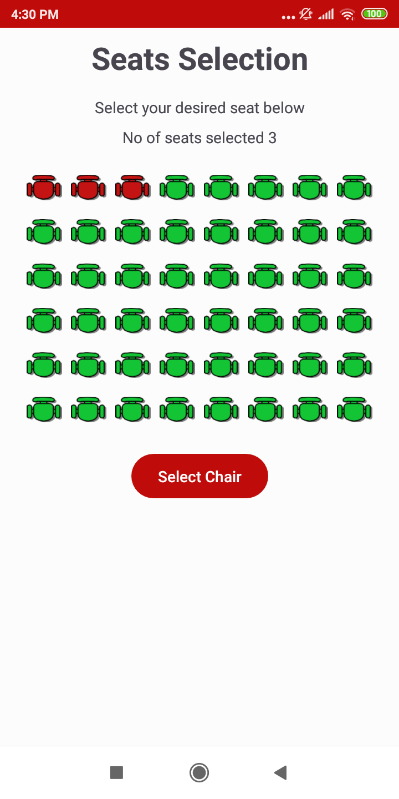
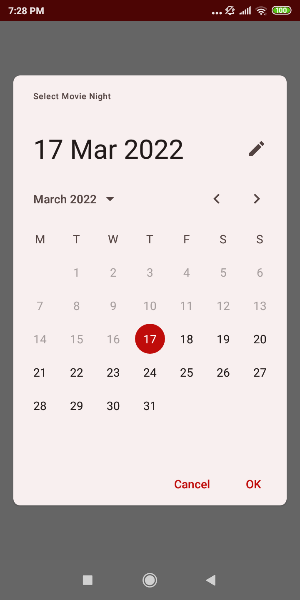
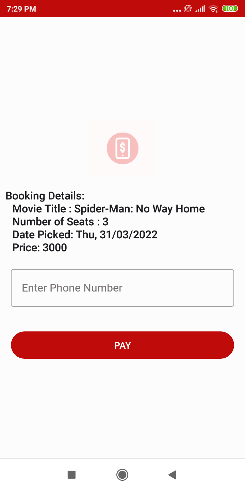

# Cinema
CinemaApp is an application that uses a section of Android Jetpack libraries and also Retrofit to display data from 
[TheMovieDB](https://www.themoviedb.org/documentation/api) API in terms of popular movies for booking using [MPESA](https://en.wikipedia.org/wiki/M-Pesa).

### Prerequisites
To setup the project add the following secret and keys in `local.properties` file:
MovieDB API Key
```yaml
apiKey=""
```
Google Maps API Key
```yaml
MAPS_API_KEY=""
```
Mpesa API Consumer Key, Consumer Secret, Passkey,Business ShortCode
```yaml
CONSUMER_KEY=""
CONSUMER_SECRET=""
PASSKEY=""
BUSINESS_SHORT_CODE=""
```
Google Functions Callback Url
```yaml
CALLBACK_URL=""
```
Firebase Setup tutorial
[Firebase Setup](https://firebase.google.com/docs/android/setup)
[Firebase Authentication](https://firebase.google.com/docs/auth/android/password-auth)

To run the Project build using Android Studio or Intelli J and all the required dependencies will be downloaded and installed.

## Architecture

The project uses MVVM architecture pattern.

## Libraries Used

* [ViewModel](https://developer.android.com/topic/libraries/architecture/viewmodel/) - Store and manage UI-related data in a lifecycle conscious way.
* [ViewBinding](https://developer.android.com/topic/libraries/data-binding) - Library that helps write code that interacts with views more easily.
* [Navigation Component](https://developer.android.com/guide/navigation/navigation-getting-started) - Android Jetpack's Navigation component helps in implementing navigation between fragments.
* [Retrofit](https://square.github.io/retrofit/) - To access the Rest Api.
* [Dagger Hilt](https://developer.android.com/jetpack/androidx/releases/hilt) - For Dependency Injection.
* [Paging 3](https://developer.android.com/topic/libraries/architecture/paging/v3-overview?hl=in) - Allow pagination of the data.
* [Datastore](https://developer.android.com/topic/libraries/architecture/datastore) - To store seat IDS in key value pairs.
* [MpesaDaraja](https://github.com/jumaallan/android-mpesa-api) - Mobile Money transaction api.
* [Room](https://developer.android.com/training/data-storage/room) - Used as local database to store booked tickets.
* [GOOGLE CLOUD FUNCTIONS](https://cloud.google.com/functions/) - functions as a service (FaaS) to run your code with zero server management.

## UI
||||
|:----:|:----:|:----:|
||||
|||

## CREDIT FOR ICON
<a target="_blank" href="https://icons8.com/icon/82675/mobile-payment">Mobile Payment</a> icon by <a target="_blank" href="https://icons8.com">Icons8</a>